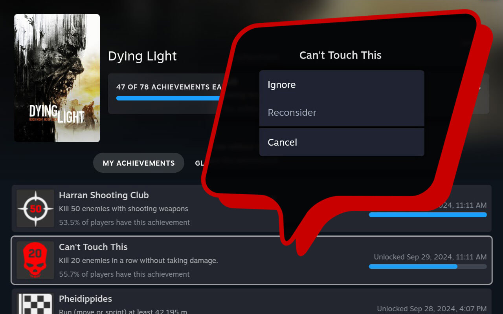

# 🏆 Achievements Manager 

Get full control over your achievements

## Features
- Ignore undesirable achievement to make Steam think it does not exist
- Reconsider ignored achievements
- Unlock achievements
- Fix glitched stats for unlocked achievements
- Recalculate the plugin cache if something goes wrong
- Reset all changes

## Installation
1. [Install the Decky Loader](https://github.com/SteamDeckHomebrew/decky-loader#installation)
2. Use the built-in plugin store to download the Achievement Manager

## Usage

Once you have installed Achievements Manager:
- Open a game page from "Home" or "Library"
- Go to achievements page by clicking any achievement in "Your stuff" tab
- Click any achievement in "My achievements" tab to unlock or ignore achievement, fix glitched stats
- Click any achievement in "Ignored achievements" tab to reconsider ignored achievement

If something goes wrong: 
- Press the  button to open Quick Access Menu (QAM)
- Navigate to the  icon
- Click "Achievements Manager" item and recalculate the plugin cache or reset all changes

## Credits
"Unlock" achievement and "Fix stats" features are based on the PaulCombal's [SamRewritten](https://github.com/PaulCombal/SamRewritten) project which in turn is based on the idea of gibbed's [SteamAchievementManager](https://github.com/gibbed/SteamAchievementManager).

## Footnotes
This software is licensed under the GNU GPL v3 and comes with no warranty. Use "Unlock" achievement and "Fix stats" features at your own risk. We believe you should not get any Steam ban using it, but we do not take any responsibility over your user experience.